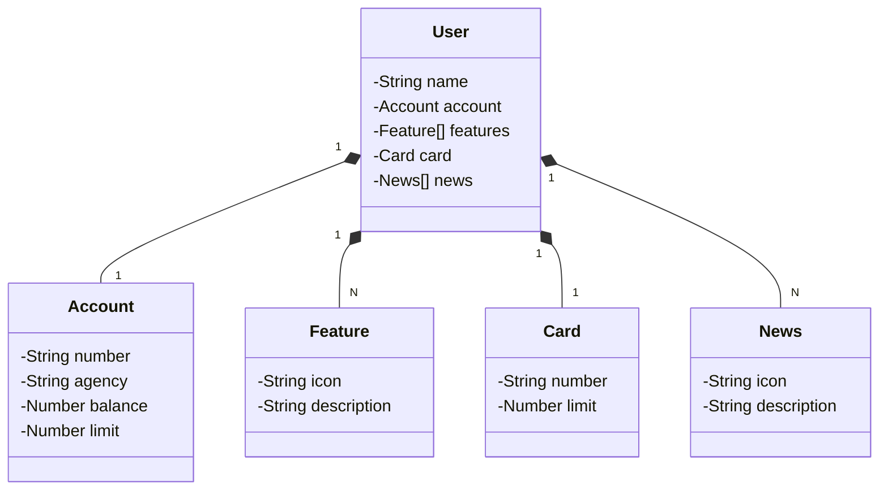

# Rest API Bank App
Aplicação desenvolvida durante o módulo *Desenvolvimento de APIs com Spring Framework* do Bootcamp **Decola Tech 2025**.

## 📖 Sumário
- [1. Domínio da aplicação](#1--domínio-da-aplicação)
  - [1.1 Descrição das entidades](#descrição-das-entidades)
  - [1.2 Diagrama de classes](#descrição-das-entidades)
- [2. Funcionalidades](#2--funcionalidades)
- [3. Tecnologias](#3--tecnologias)

## 1. 🌍 Domínio da aplicação
O domínio da aplicação (contexto de uso real) busca abstrair componentes e funcionalidades de um aplicativo de banco, permitindo flexibilidade e transporte de dados.

### 1.1 Descrição das entidades
A seguir, estão as entidades que fazem parte do domínio da aplicação:
- User ( Usuário que interage com o aplicativo bancário )
- Account ( Conta bancária gerenciada pelo usuário )
- Feature ( Funcionalidade/Ação presente no aplicativo bancário )
- Card ( Cartão possuído pelo usuário )
- News ( Notícias presentes no aplicativo para visualização do usuário )

### 1.2 Diagrama de classes

## 2. ⚙️ Funcionalidades
Funcionalidades fornecidas pela API:
- operações CRUD
- Respostas em formato Json

## 3. 💻 Tecnologias
Tecnologias utilizadas para desenvolvimento:
- Spring Framework ( Core )
- Spring Boot
- Spring Data JPA
- PostgreSQL ( SGBD ) 