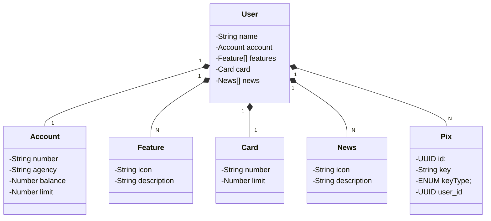

# Rest API Bank App
Aplicação desenvolvida durante o módulo *Desenvolvimento de APIs com Spring Framework* do Bootcamp **Decola Tech 2025**.

## 📖 Sumário
- [1. Domínio da aplicação](#1--domínio-da-aplicação)
  - [1.1 Descrição das entidades](#11-descrição-das-entidades)
  - [1.2 Diagrama de classes](#12-diagrama-de-classes)
- [2. Funcionalidades](#2--funcionalidades)
- [3. Tecnologias](#3--tecnologias)
- [4. Como rodar localmente?](#4--como-rodar-localmente)
  - [4.1 Requisitos](#41-requisitos)
  - [4.2 Clone o repositório GitHub](#42-clone-o-repositório-github)
  - [4.3 Construa as imagens](#43-construa-as-imagens)
  - [4.4 Crie e execute os containers](#44-crie-e-execute-os-containers)
- [5. Documentação](#5--documentação)

## 1. 🌍 Domínio da aplicação
O domínio da aplicação (contexto de uso real) busca abstrair componentes e funcionalidades de um aplicativo de banco, permitindo flexibilidade e transporte de dados.

### 1.1 Descrição das entidades
A seguir, estão as entidades que fazem parte do domínio da aplicação:
- User ( Usuário que interage com o aplicativo bancário )
- Account ( Conta bancária gerenciada pelo usuário )
- Feature ( Funcionalidade/Ação presente no aplicativo bancário )
- Card ( Cartão possuído pelo usuário )
- News ( Notícias presentes no aplicativo para visualização do usuário )
- Pix ( Pix cadastrados pelo usuário )

### 1.2 Diagrama de classes



## 2. ⚙️ Funcionalidades
Funcionalidades fornecidas pela API:
- operações CRUD
- Respostas em formato Json

## 3. 💻 Tecnologias
Tecnologias utilizadas para desenvolvimento:
- Spring Framework ( Framework Core da aplicação )
- Maven ( Gerenciador de dependências )
- Spring Boot ( Codebase da aplicação )
- Spring Data JPA ( Integração e conexão com banco de dados )
- PostgreSQL ( SGBD )

## 4. 🏠 Como rodar localmente
Para rodar localmente, é necessário seguir alguns passos:

### 4.1 Requisitos
- Docker
- Docker Desktop (Windows)
- Git

*obs. Caso o seu sistema operacional seja Windows, siga esses passos para [configuração do Docker Desktop](https://docs.docker.com/desktop/setup/install/windows-install/).*

### 4.2 Clone o repositório GitHub
Execute o comando abaixo no diretório desejado:
```bash
git clone https://github.com/CarlosfcPinheiro/BankApp-API.git && cd BankApp-API
```

### 4.3 Construa as imagens
Faça o build dos containers no docker-compose:
```shell
docker-compose build
```

### 4.4 Crie e execute os containers
Execute os containers de aplicação e banco de dados:
````shell
docker-compose -p bankapp up -d
````

## 5. 📝 Documentação
A documentação da API foi feita com a especificação Swagger e está disponível na URI: ``/swagger-ui/index.html``
